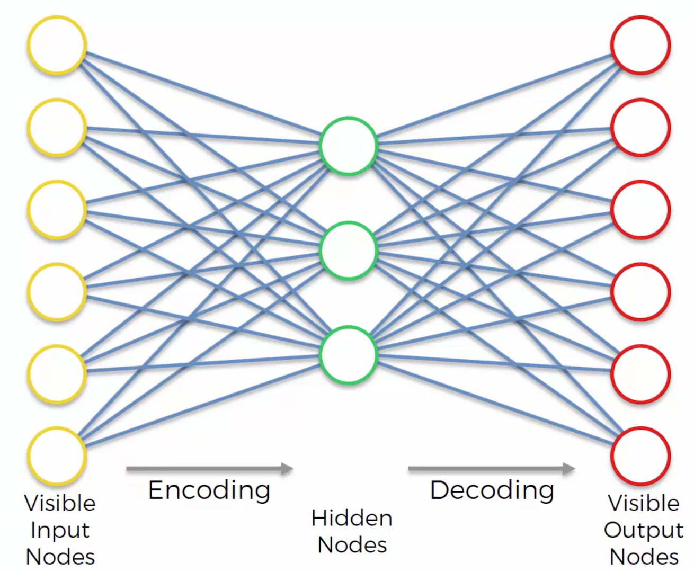
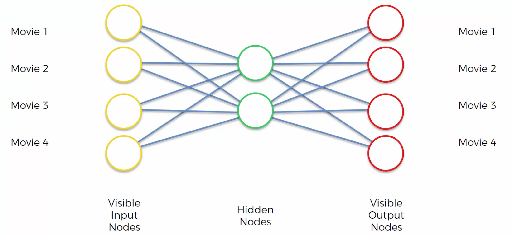
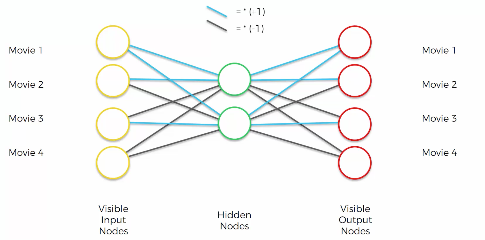
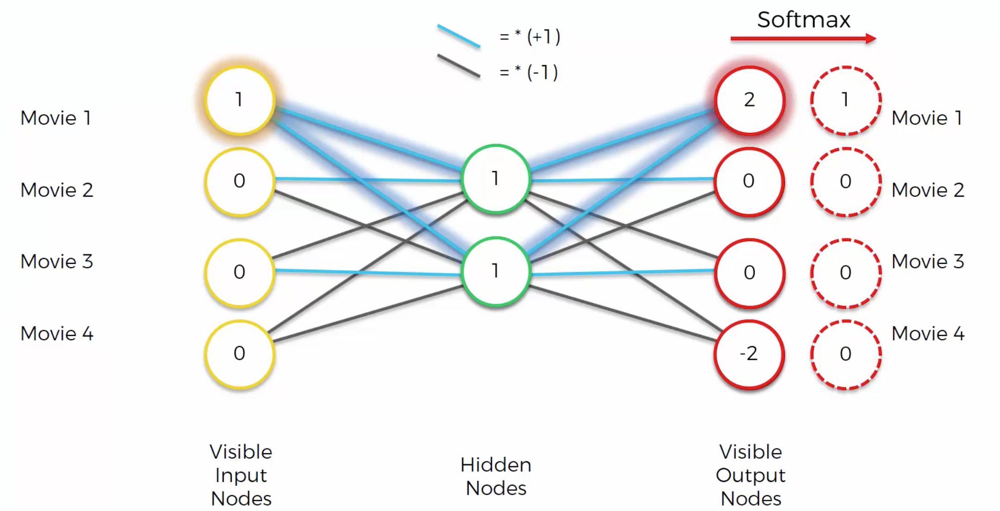
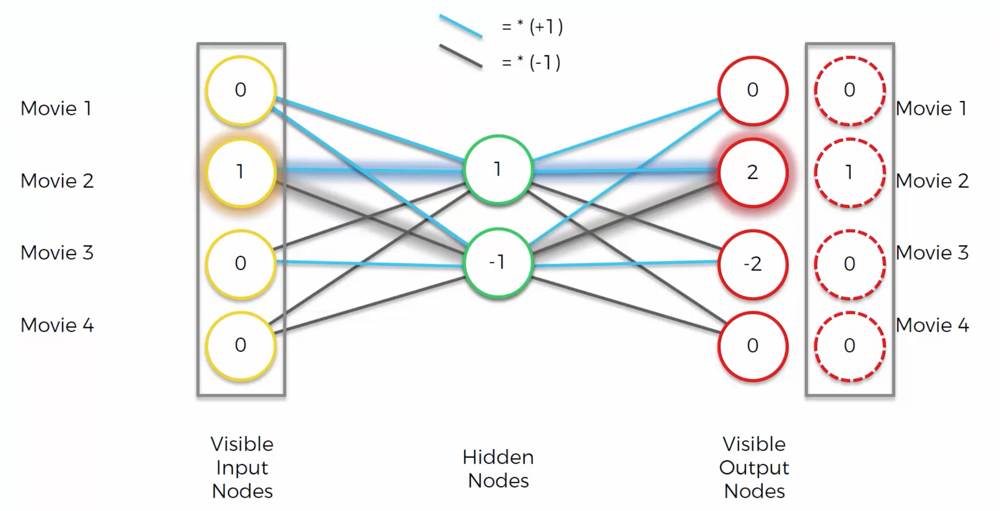
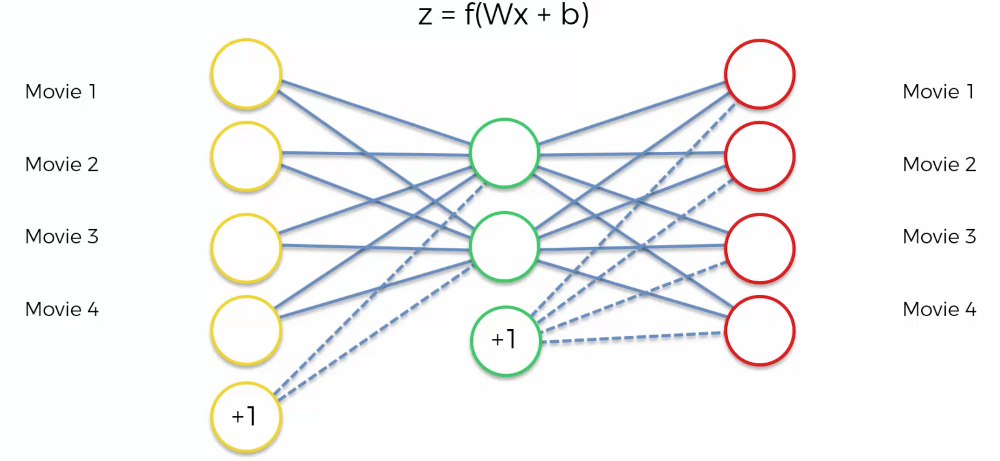
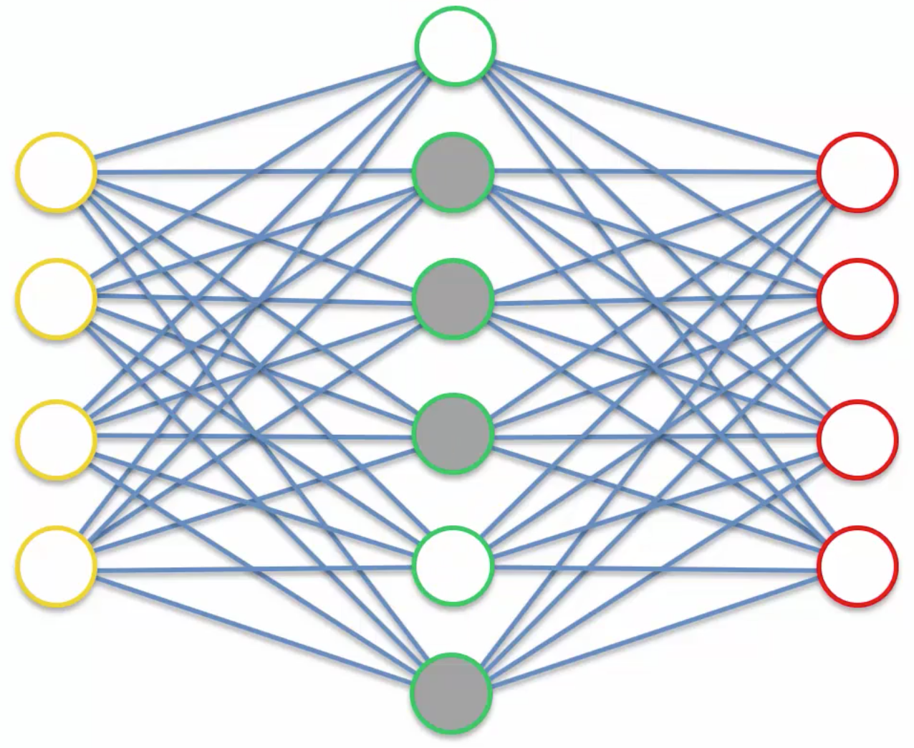
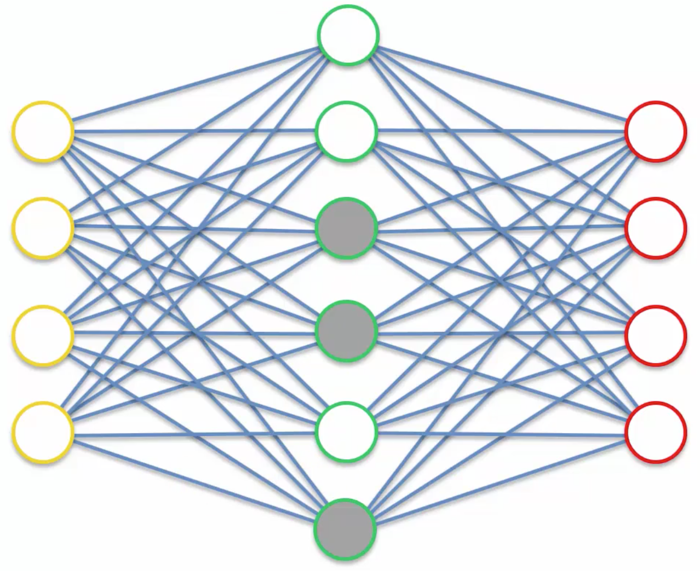
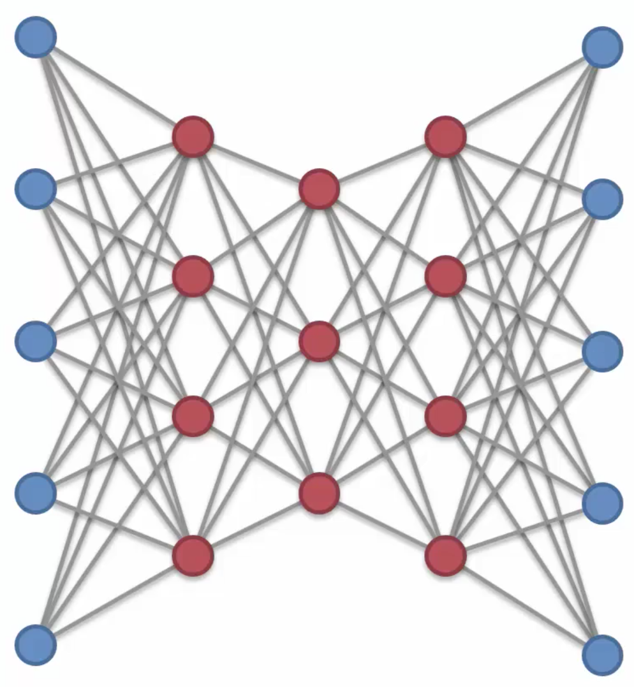

## Let's get a hang of it ❄️ 

An autoencoder is an Unsupervised Learning technique that applies backpropagation, setting the target values to be equal to the input values. We'll design a neural network architecture such that we impose a bottleneck in the network which forces a compressed knowledge representation of the original input.

> Data denoising and and Dimensionality reduction are the two major applications of Autoencoders.

It's capable of implementing some amazing things, ranging from image colorization, image generation to dialogue generation. 

* **Encode** - Compress the inputs to a few bits, also called the *latent-space representation*. 
* **Decode** - Reconstruct the image from the above generated latent-space representation. 

So, why are we doing this, wherein we're constructing the input back at the output side (there's no output though)?
The reason is, if at all the input is constructed reliably at the output side, it indicates that the hidden layers have enough information to represent the output. Hence, in an autoencoder, we care about the hidden layer(s). A hidden layer is smaller than the input and output layer, in terms of the number of nodes, and henceforth, stores dense information. If at all the hidden layer is the same as the input layer, then the network just blindly memorizes the data by passing the values to the output layer. Therefore, we need to make sure to let the **hidden layer be the bottleneck**. 

This feature of the autoencoder produces a lower-dimensional representation of the input. In this case, the autoencoder is termed to be **undercomplete**. And yes, this is how, we would do dimensionality reduction using an autoencoder (A no-brainer indeed!). 

*Why not PCA?*  
PCA is restricted to a linear map, whereas autoencoders can have non-linear encoder/decoder. That is, if we were to use linear activation functions at each layer in an autoencoder, it would be the same as PCA. Nonetheless, if it were non-linear activation functions, autoencoders trump PCA.

It's also used for *image classification* purposes, say a set of images belonging to a particular class are sent and trained. Take a note of this, 'only a single class images are sent'. The model gets trained, learns the parameters, and then, when a new instance is sent to it, it calculates the reconstruction error existing between the reconstructed image and the actual image. If the error is low, then it's likely belonging to the same class on which the model is trained. Hence, **Binary Classification** does make sense in the case of autoencoders which can indeed be extended to **Anomaly detection** as well. 

An interesting point to take note of is, it has this adversarial nature embedded in it, similar to the way **Generative Adversarial Networks** function. The trade-off in here, exists between the reconstruction loss and the regularizer. Reconstruction loss should be low between the input image and the reconstructed image, but the regularizer discourages over-memorization or overfitting. 

Let's now build the simplest autoencoder. Checkout the **simple_autoencoder.ipynb** in **codes** repo.

Time to dive deep!💨 Let's get a clear view of autoencoders with an example.

In here, we've considered an example wherein the input nodes are used to depict the movies. So, now let's see how we could prove the objective part.

* We need to differentiate between the negative and positive synapses firstly.

* Say, we liked Movie 1 and disliked all the other three movies, then the input would be like, 1, 0, 0, 0. From this using the synapses or weights, we compute the hidden layer nodes values and then similarly extend this to the output nodes. For the first hidden node, the value can be calculated using, 1 + 0 - 0 - 0 = 1. Similarly, for the second hidden node. The first output node = 1 + 1 = 2. 

* After computing all the other remaining values, we apply softmax function to the output layer to get the same values as the values of the input nodes.

* If the second input is 1,the output is the same as the input.

* At times, we often come across representations involving biases in an AutoEncoder Neural Net.

So, what have we inferred from the above example? The autoencoder is getting trained as per the rules, and henceforth, we've, in this case, assumed the weights previously, to know how it thereafter works.

We do have different types of autoencoders available. Let's discuss about these in the following sections.

### Sparse autoencoders

*Why?* 
When the size of the hidden layer remains constant throughout, it might lead to learning an approxiamtion of PCA. 

It is an autoencoder which has more number of hidden layer units than the input layer but additionally, implements Regularization technique(prevents overfitting or helps in stabilising the model). We need to prevent overfitting because the increase in the number of hidden layer units leads to the rise in the number of features which might get us to an overfitting problem. This includes a penalty unit added to the loss function, so at any time, only a specific set of hidden layer units are used instead of the whole.

So, only the 1st and 5th hidden units are used.

In another pass,

the above nodes participate.

Now the autoencoder cannot cheat by just passing in the inputs without any combinations in case of more number of hidden layer units.

Find the code for the above in **sparse_autoencoders.ipynb** in *codes* repo.

### Deep autoencoders

It's composed of two, symmetrical **Deep Belief Networks** that have four or five shallow layers representing the encoding half of the net, and second set of four or five layers that make up the decoding half.

The layers are **Restricted Boltzmann machines**, the building blocks of deep-belief networks.

